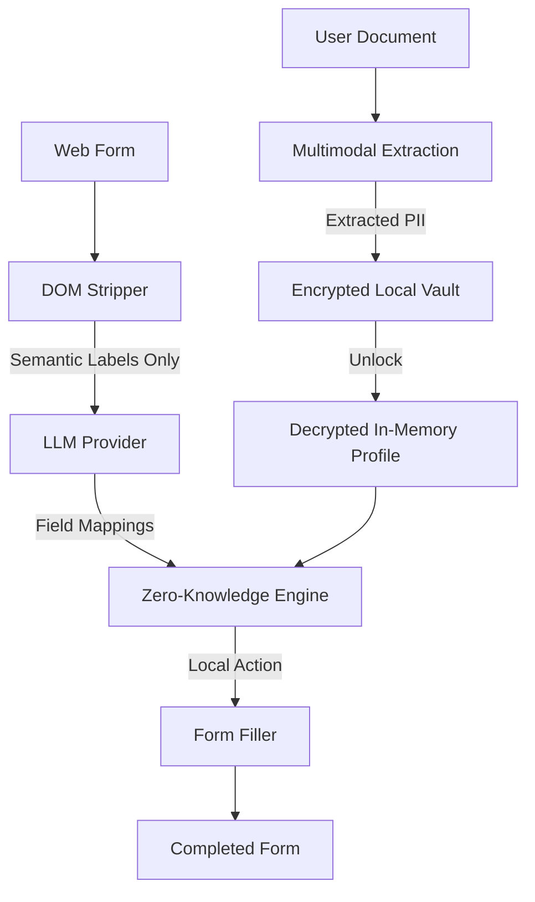

# 🗳️ CitizenOne
### **The Autonomous, Privacy-First Agent for Bureaucratic Automation.**

**CitizenOne** is an open-source, BYOK (Bring Your Own Key) browser extension designed to automate government and bureaucratic forms with zero-knowledge of your PII (Personally Identifiable Information). It works on low-spec hardware and mobile browsers, ensuring accessibility for everyone.

---

## 🛡️ Core Mission: Privacy by Design

The biggest barrier to AI form automation is privacy. **CitizenOne** solves this using the **Shadow Form Strategy**:
1. **DOM Stripping**: The extension extracts only the *labels* and *structure* of a form.
2. **Zero-Knowledge Analysis**: The LLM receives field labels (e.g., "First Name", "Date of Birth") but **never** receives your actual data.
3. **Local Filling**: The decrypted profile data stays in a local encrypted vault. The extension maps the AI's logic to your local data and fills the form entirely on your machine.

---

## ✨ Key Features

- **🔐 Encrypted Vault**: AES-256 (Crypto-JS) encryption with PBKDF2 key derivation. Your master password is the only key, and it never leaves your device.
- **📄 Quick Intake (Document Intelligence)**: Upload a photo or PDF of your ID or utility bill. Gemini 1.5 Flash extracts the data and populates your vault automatically.
- **🖱️ One-Click Auto-Fill**: Simply click the extension icon in your browser toolbar to automatically analyze and fill the current page.
- **🤖 BYOK Provider Factory**: Swap between high-performance AI models:
  - **Gemini 1.5 Flash** (Free tier via Google AI Studio)
  - **Groq (Llama 3)** (Ultra-fast, sub-second inference)
  - **NVIDIA NIM** (High-reasoning Llama-3.1-70B via free credits)
  - **Ollama** (100% local fallback for total air-gapped privacy)
- **📱 Mobile-First Design**: Optimized for Kiwi/Orion browsers with a bottom-sheet layout and tappable UI.
- **🧠 Semantic Mapping Engine**: Sophisticated label resolution using `aria-label`, `labelledBy`, and surrounding context.
- **⚡ Reactive Filling**: Works with React, Vue, and Angular-controlled forms by dispatching native events.

---

## 🛠️ Technical Stack

- **Framework**: [WXT](https://wxt.dev/) (Web Extension Framework)
- **UI**: [React](https://reactjs.org/) + [Tailwind CSS](https://tailwindcss.com/)
- **Language**: [TypeScript](https://www.typescriptlang.org/)
- **Bundler**: [Vite](https://vitejs.dev/)
- **Encryption**: [CryptoJS](https://cryptojs.gitbook.io/) (AES-256 + PBKDF2)
- **State**: Chrome Storage Local (Encrypted at rest)

---

## 🚀 Getting Started

### Prerequisites
- [Node.js](https://nodejs.org/) (v20+)
- [npm](https://www.npmjs.com/)

### Installation

1. **Clone the repository**:
   ```bash
   git clone https://github.com/your-username/citizen-one.git
   cd citizen-one
   ```

2. **Install dependencies**:
   ```bash
   npm install
   ```

3. **Start Development Mode**:
   ```bash
   npm run dev
   ```
   *This will launch a browser instance with the extension loaded.*

4. **Build for Production**:
   ```bash
   npm run build
   ```
   *The extension will be ready in the `dist/chrome-mv3` folder.*

---

## 📖 Usage Guide

1. **Initialize Your Vault**:
   - Open the popup and click **Create Your Vault**.
   - Choose a strong Master Password (cannot be recovered!).
   - **Quick Intake**: Go to the Vault tab and upload a document (ID, Bill, etc.) to populate your profile automatically using AI.

2. **Configure AI Provider**:
   - Go to **Settings > Providers**.
   - Input your API key (Gemini, Groq, or NVIDIA).
   - Click **Test Connection** to verify.

3. **Fill a Form**:
   - Navigate to any government or administrative website.
   - **Method A**: Click the **CitizenOne icon** in your browser toolbar for instant auto-fill.
   - **Method B**: Open the popup and click **Auto-Fill This Page** for a step-by-step preview.

---

## 🏗️ Architecture



---

## 🗺️ Roadmap Phase 1 (Current)
- [x] MV3 Scaffolding & Encryption Utility
- [x] BYOK Provider Factory (Gemini, Groq, NVIDIA, Ollama)
- [x] DOM Semantic Mapping Strategy
- [x] Mobile-First Popup UI & Zero-Knowledge Workflow
- [x] **Document Intelligence (Quick Intake)**
- [x] **One-Click Auto-Fill Implementation**

---

## 🤝 Contributing
CitizenOne is open-source. We welcome contributions to help make bureaucratic automation accessible to everyone. Please check our `CONTRIBUTING.md` (coming soon).

---

## ⚖️ License
MIT License. **Privacy is a human right.**

