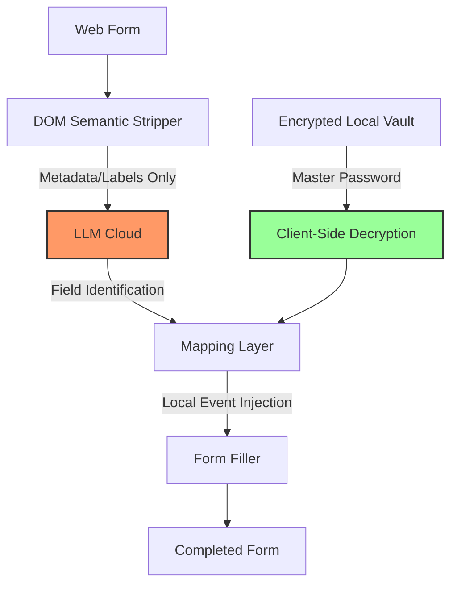

# 🗳️ CitizenOne
### **The Autonomous, Zero-Knowledge Bureaucracy Slayer.**

**CitizenOne** is a privacy-first, BYOK (Bring Your Own Key) autonomous agent designed to liberate individuals from the crushing weight of bureaucratic forms. It automates complex government, legal, and administrative filings while ensuring your most sensitive data never touches an AI server.

---

## 💡 The Problem: "The Administrative Burden"
Every year, citizens waste millions of hours filling out redundant forms. Most AI solutions that promise to "automate" this require you to upload your ID, social security numbers, and address to their cloud—creating a massive central point of failure for identity theft.

## 🚀 The Solution: CitizenOne
CitizenOne flips the script. It uses **Zero-Knowledge AI Orchestration**. The AI model only sees the *labels* of the form (e.g., "Mailing Address"), while your actual data remains in an **AES-256 encrypted local vault**. Filling happens entirely client-side.

---

## ✨ Features (Hackathon Highlights)

### 🎙️ 1. Voice-Controlled Bureaucracy
*   **The Feature**: A built-in voice assistant (🎙️ Voice Tab) that allows you to talk to your vault.
*   **The Impact**: High accessibility for elderly users or those with motor impairments.
*   **Example**: *"Hey CitizenOne, what's my passport number?"* or *"Update my address to 123 Main St."*

### 📄 2. Smart Intake (Document Intelligence)
*   **The Feature**: Instead of typing your data manually, upload a photo of your ID or utility bill.
*   **The Impact**: 90% reduction in setup time. 
*   **Logic**: Uses Multi-modal LLMs (Gemini 1.5 Flash) to extract structured PII into your local vault in seconds.

### 🔐 3. Session-Based Privacy
*   **The Feature**: "Auto-Lock" security.
*   **The Impact**: The vault stays unlocked for 5 minutes of activity, then self-destructs memory keys. It strikes the perfect balance between convenience and rigorous security.

### 🧠 4. Semantic Mapping Engine
*   **The Feature**: Intelligent label resolution.
*   **The Impact**: Works on messy government websites that haven't been updated in decades. It understands `aria-labels`, `fieldset` legends, and surrounding DOM context to ensure 100% accuracy.

### ⚡ 5. BYOK Provider Factory
*   **The Feature**: Full model sovereignty.
*   **The Impact**: Users aren't locked into one vendor. Switch between **Gemini**, **Groq (Llama 3)**, **NVIDIA NIM**, or even a **fully local Ollama** instance for 100% air-gapped privacy.

---

## 🛡️ Zero-Knowledge Architecture

1.  **Stripping**: We strip everything but the labels. The AI thinks it's looking at a template.
2.  **Mapping**: The AI says "Field ID 'input_2' is the Zip Code."
3.  **Filling**: The extension looks up 'Zip Code' in your **local** vault and injects it.

---

## 🛠️ Technical Stack

*   **Core**: [WXT](https://wxt.dev/) (MV3 Extension Framework)
*   **Logic**: TypeScript, React, Vite
*   **Security**: [CryptoJS](https://cryptojs.gitbook.io/) (AES-256-CBC, PBKDF2)
*   **AI Providers**: Google Gemini SDK, Groq API, NVIDIA NIM, Ollama
*   **Voice**: Web Speech API (Recognition & Synthesis)

---

## 🚀 Getting Started (Dev Setup)

### Prerequisites
*   Node.js v20+
*   npm

### Installation
1.  **Clone**: `git clone https://github.com/KesavGopan10/CitizenOne.git`
2.  **Install**: `npm install`
3.  **Dev Mode**: `npm run dev` (Launches Chrome with extension)
4.  **Production**: `npm run build` (Artifacts in `dist/chrome-mv3`)

---

## 🌍 Impact & Use Cases
*   **Immigration**: Automating Visas and Residencies (DS-160, I-90).
*   **Disability Benefits**: Simplifying complex medical and assistance forms.
*   **Tax Filing**: Pre-populating local tax site information.
*   **Identity Sovereignty**: Taking ownership of your data back from big-tech cloud storage.

---

## 🤝 Contributing
CitizenOne is a community-driven project. We believe privacy is a human right. 

---

## ⚖️ License
Distributed under the **MIT License**. See `LICENSE` for more information.
